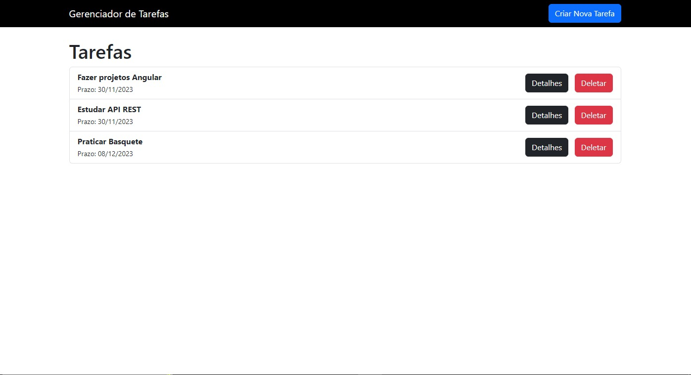
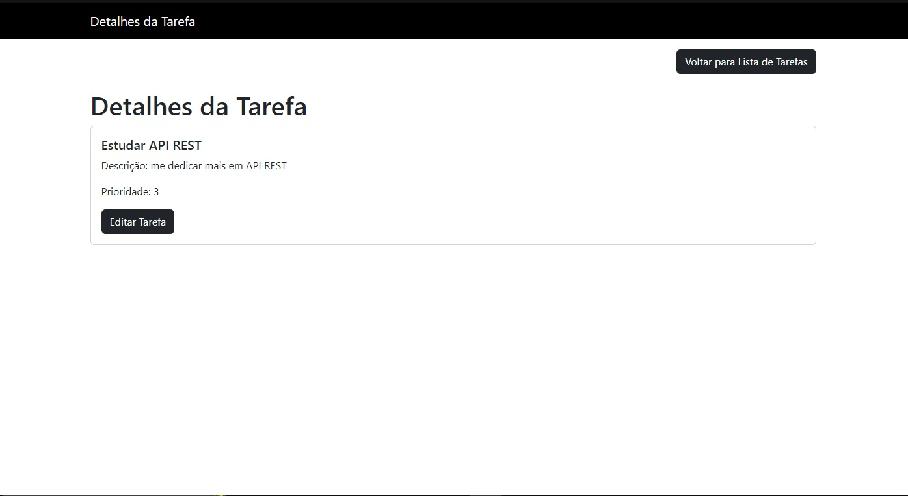
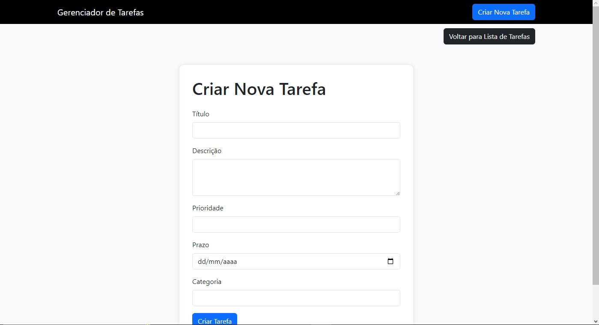
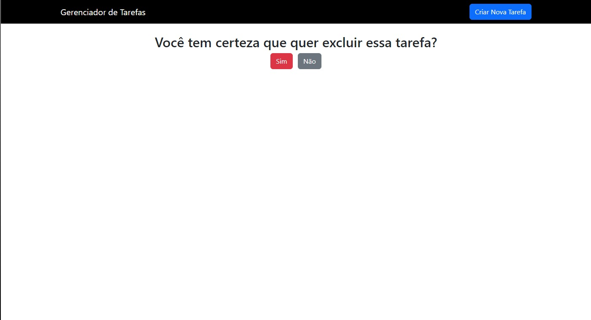
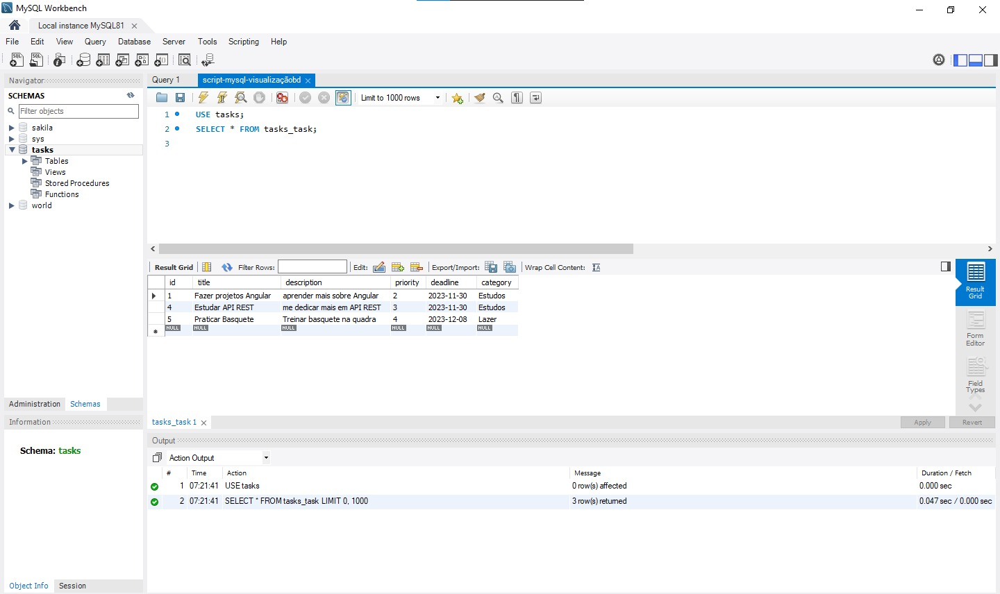

<h1 align="center">:file_cabinet:Gerenciador de Tarefas</h1>

## :memo: Descrição
Gerenciador de Tarefas no qual você poderá ter o controle sobre suas tarefas á serem realizadas. Você poderá visualizar o nome da tarefa, sua descrição, sua prioridade e seu prazo.

## :books: Funcionalidades
* <b>Funcionalidade </b>: a API gerencia suas tarefas, assim como te dá a opção de criar uma nova tarefa, editar sua tarefa, visualizar os detalhes específicos da tarefa e, caso você queira, excluir a mesma. Todas as informações serão amarzenadas em um banco de dados relacional (o banco de dados utilizado nesse projeto foi o MySQL).

## :wrench: Tecnologias utilizadas
* Linguagem Python, juntamente com o Framework Django e a biblioteca de componentes Front-END Bootstrap. O banco de dados utilizado nesse projeto foi o MySQL. També foram utilizadas as bibliotecas decouple e dj-database-url, para esconder dados cruciais.

## :soon: Implementação futura
* A API poderá ser utilizada por qualquer pessoa que deseja um método mais prático e ágil de organizar suas tarefas. o Projeto poderá ser retomado para obter mais funcionalidades.

## :handshake: Colaboradores
<table>
  <tr>
    <td align="center">
      <a href="https://github.com/armandomonteir-o">
         
        
          <b>Armando Monteiro</b>
        
      </a>
    </td>
  </tr>
</table>

## :dart: Status do projeto
* Concluido. (Poderá ser atualizado em um futuro próximo).
